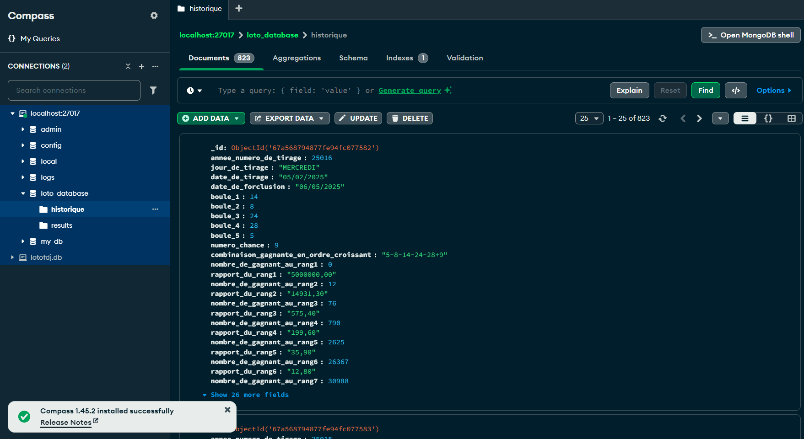
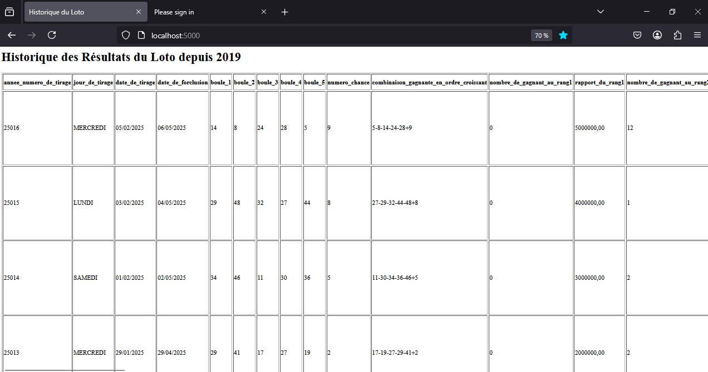
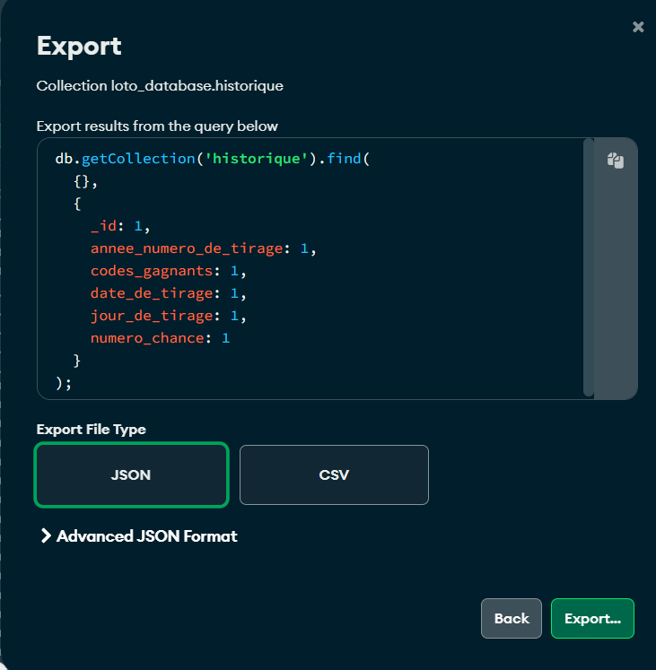
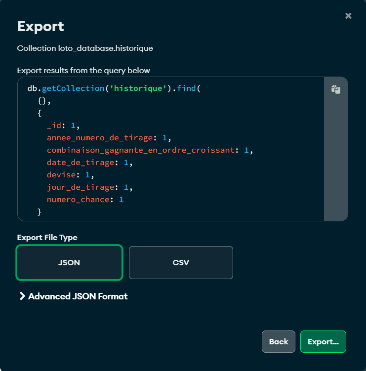
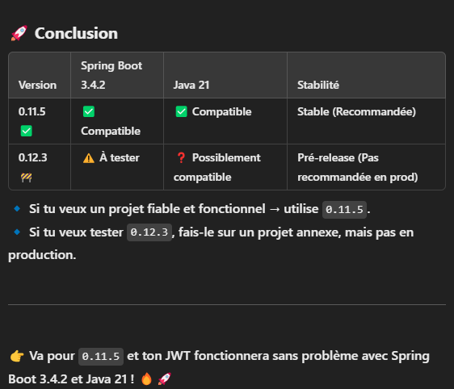

# Loto_API
Loto_API

```SQL
-- Activer les clés étrangères
PRAGMA foreign_keys = ON;

-- Création de la table des utilisateurs
CREATE TABLE IF NOT EXISTS users (
    id TEXT PRIMARY KEY,
    first_name TEXT NOT NULL,
    last_name TEXT NOT NULL,
    email TEXT UNIQUE NOT NULL,
    password TEXT NOT NULL,
    is_admin INTEGER DEFAULT 0 CHECK (is_admin IN (0, 1)),
    created_at TEXT DEFAULT (datetime('now', 'utc')),
    updated_at TEXT DEFAULT (datetime('now', 'utc'))
);

-- Création de la table des tickets
CREATE TABLE IF NOT EXISTS tickets (
    id TEXT PRIMARY KEY,
    numbers TEXT NOT NULL,  -- 5 numéros entre 0 et 49 (ex: "5,12,23,34,48")
    lucky_number INTEGER CHECK(lucky_number BETWEEN 1 AND 10) NOT NULL,  -- Numéro chance
    draw_date TEXT NOT NULL,  -- Date du tirage (YYYY-MM-DD)
    draw_day TEXT CHECK(draw_day IN ('lundi', 'mercredi', 'samedi')) NOT NULL,  -- Jour du tirage
    created_at TEXT DEFAULT (datetime('now', 'utc')),
    updated_at TEXT DEFAULT (datetime('now', 'utc'))
);

-- Création de la table de relation entre utilisateurs et tickets
CREATE TABLE IF NOT EXISTS user_ticket (
    user_id TEXT NOT NULL,
    ticket_id TEXT NOT NULL,
    role TEXT CHECK(role IN ('creator', 'assignee', 'watcher')) DEFAULT 'creator',
    PRIMARY KEY (user_id, ticket_id),
    FOREIGN KEY (user_id) REFERENCES users(id) ON DELETE CASCADE,
    FOREIGN KEY (ticket_id) REFERENCES tickets(id) ON DELETE CASCADE
);

-- Insertion des utilisateurs avec des UUIDv4 valides
INSERT INTO users (id, first_name, last_name, email, password, is_admin, created_at, updated_at) VALUES
    ('36c9050e-ddd3-4c3b-9731-9f487208bbc1', 'Admin', 'HBnB', 'admin@hbnb.io',
     '$2a$12$ivDzHW.L7rqF14ymAdvBOswVX4zsrfE1B1a5mmW.Yx6e7ZKY0W', 1, datetime('now', 'utc'), datetime('now', 'utc')),

    ('bcd38036-746b-40ac-924f-a5810a2b5bb9', 'John', 'Doe', 'user@hbnb.com',
     '$2b$12$jEpgrC2tZa1rcJQJh4OS/tir9E7XNH4/3MG.gSQ.FfFesiYBAq', 0, datetime('now', 'utc'), datetime('now', 'utc')),

    ('a1b2c3d4-e5f6-7890-1234-56789abcdef0', 'Alice', 'Dupont', 'alice@hbnb.com',
     '$2b$12$ABCDEFG1234567ijklmnoPQRSTUVWXYZabcdefghi', 0, datetime('now', 'utc'), datetime('now', 'utc')),

    ('0987abcd-6543-ef12-3456-789abcdef012', 'Bob', 'Martin', 'bob@hbnb.com',
     '$2b$12$JKLMNOPQRSTUVWXYZ1234567890abcdefgHIJKLMN', 0, datetime('now', 'utc'), datetime('now', 'utc'));

-- Insertion de 10 tickets par utilisateur
INSERT INTO tickets (id, numbers, lucky_number, draw_date, draw_day, created_at, updated_at) VALUES
    ('550e8400-e29b-41d4-a716-111111111111', '5,12,23,34,48', 7, '2025-02-10', 'lundi', datetime('now', 'utc'), datetime('now', 'utc')),
    ('550e8400-e29b-41d4-a716-222222222222', '2,14,27,39,45', 3, '2025-02-12', 'mercredi', datetime('now', 'utc'), datetime('now', 'utc')),
    ('550e8400-e29b-41d4-a716-333333333333', '1,8,19,24,30', 9, '2025-02-15', 'samedi', datetime('now', 'utc'), datetime('now', 'utc')),
    ('550e8400-e29b-41d4-a716-444444444444', '7,16,22,35,47', 4, '2025-02-17', 'lundi', datetime('now', 'utc'), datetime('now', 'utc')),
    ('550e8400-e29b-41d4-a716-555555555555', '4,13,28,36,41', 2, '2025-02-19', 'mercredi', datetime('now', 'utc'), datetime('now', 'utc')),
    ('550e8400-e29b-41d4-a716-666666666666', '9,17,23,38,42', 10, '2025-02-22', 'samedi', datetime('now', 'utc'), datetime('now', 'utc')),
    ('550e8400-e29b-41d4-a716-777777777777', '6,15,21,33,46', 1, '2025-02-24', 'lundi', datetime('now', 'utc'), datetime('now', 'utc')),
    ('550e8400-e29b-41d4-a716-888888888888', '3,11,20,29,44', 8, '2025-02-26', 'mercredi', datetime('now', 'utc'), datetime('now', 'utc')),
    ('550e8400-e29b-41d4-a716-999999999999', '10,18,25,31,49', 5, '2025-03-01', 'samedi', datetime('now', 'utc'), datetime('now', 'utc')),
    ('550e8400-e29b-41d4-a716-000000000000', '12,19,26,32,40', 6, '2025-03-03', 'lundi', datetime('now', 'utc'), datetime('now', 'utc'));

-- Association des tickets aux utilisateurs
INSERT INTO user_ticket (user_id, ticket_id, role) VALUES
    ('bcd38036-746b-40ac-924f-a5810a2b5bb9', '550e8400-e29b-41d4-a716-111111111111', 'creator'),
    ('bcd38036-746b-40ac-924f-a5810a2b5bb9', '550e8400-e29b-41d4-a716-222222222222', 'creator'),
    ('bcd38036-746b-40ac-924f-a5810a2b5bb9', '550e8400-e29b-41d4-a716-333333333333', 'creator'),
    ('bcd38036-746b-40ac-924f-a5810a2b5bb9', '550e8400-e29b-41d4-a716-444444444444', 'creator'),
    ('a1b2c3d4-e5f6-7890-1234-56789abcdef0', '550e8400-e29b-41d4-a716-555555555555', 'creator'),
    ('a1b2c3d4-e5f6-7890-1234-56789abcdef0', '550e8400-e29b-41d4-a716-666666666666', 'creator'),
    ('a1b2c3d4-e5f6-7890-1234-56789abcdef0', '550e8400-e29b-41d4-a716-777777777777', 'creator');


```
sqlite3 loto.db < script.sql


user + mdp: 5886e3a3-1f4c-411a-a7a4-5075abcef8f2
avant sqlite

avec sqlite:

```plain txt
/src/main/java/com/fdjloto/api/
│── LotoApiApplication.java
│
├── controller/   -> Contient les contrôleurs REST
│   └── TicketController.java
│
├── model/        -> Contient les entités JPA (modèles de base de données)
│   └── Ticket.java
│
├── repository/   -> Contient les interfaces pour accéder aux données
│   └── TicketRepository.java
│
├── service/      -> Contient la logique métier
│   └── TicketService.java
│
└── resources/
    ├── application.properties
    └── ...
```

http://localhost:8080/swagger-ui/index.html

http://localhost:8080/login
http://localhost:8080


📂 Organisation des fichiers
Voici les fichiers que je vais générer pour toi, basés sur ta structure :

📁 controller/ (Contrôleurs)
UserController.java
TicketController.java
HelloController.java
📁 model/ (Entités JPA)
User.java
Ticket.java
📁 repository/ (Repositories)
UserRepository.java
TicketRepository.java
📁 service/ (Services Métier)
UserService.java
TicketService.java
📁 security/ (JWT & Sécurité)
JwtUtil.java
SecurityConfig.java
📁 config/ (Configuration Hibernate pour SQLite)
SQLiteDialect.java


correction sql
```SQL
-- Suppression de l'ancienne table users
DROP TABLE IF EXISTS users;

-- Réactiver les clés étrangères
PRAGMA foreign_keys = ON;

-- Création de la nouvelle table users avec is_admin en BOOLEAN DEFAULT FALSE
CREATE TABLE users (
    id TEXT PRIMARY KEY,
    first_name TEXT NOT NULL,
    last_name TEXT NOT NULL,
    email TEXT UNIQUE NOT NULL,
    password TEXT NOT NULL,
    is_admin BOOLEAN NOT NULL DEFAULT FALSE CHECK (is_admin IN (0, 1)), -- ✅ BOOLEEN AVEC DEFAULT FALSE
    created_at TEXT DEFAULT (CURRENT_TIMESTAMP),
    updated_at TEXT DEFAULT (CURRENT_TIMESTAMP)
);

-- Réinsertion des utilisateurs
INSERT INTO users (id, first_name, last_name, email, password, is_admin, created_at, updated_at) VALUES
    ('36c9050e-ddd3-4c3b-9731-9f487208bbc1', 'Admin', 'HBnB', 'admin@hbnb.io',
     '$2a$12$ivDzHW.L7rqF14ymAdvBOswVX4zsrfE1B1a5mmW.Yx6e7ZKY0W', 1, '2025-02-05 21:51:44', '2025-02-05 21:51:44'),

    ('bcd38036-746b-40ac-924f-a5810a2b5bb9', 'John', 'Doe', 'user@hbnb.com',
     '$2b$12$jEpgrC2tZa1rcJQJh4OS/tir9E7XNH4/3MG.gSQ.FfFesiYBAq', 0, '2025-02-05 21:51:44', '2025-02-05 21:51:44'),

    ('a1b2c3d4-e5f6-7890-1234-56789abcdef0', 'Alice', 'Dupont', 'alice@hbnb.com',
     '$2b$12$jEpgrC2tZa1rcJQJh4OS/tir9E7XNH4/3MG.gSQ.FfFesiYBAq', 0, '2025-02-05 21:51:44', '2025-02-05 21:51:44'),

    ('0987abcd-6543-ef12-3456-789abcdef012', 'Bob', 'Martin', 'bob@hbnb.com',
     '$2b$12$jEpgrC2tZa1rcJQJh4OS/tir9E7XNH4/3MG.gSQ.FfFesiYBAq', 0, '2025-02-05 21:51:44', '2025-02-05 21:51:44');

-- Vérification des données après l'insertion
SELECT * FROM users;
```

```sql
ALTER TABLE tickets ADD COLUMN user_id VARCHAR(255) NOT NULL DEFAULT 'default_value';
ALTER TABLE users ADD COLUMN admin BOOLEAN NOT NULL DEFAULT false;
```


Mongodb
scraping: scrapefdjloto_mongo.py
```plaintext
root@UID7E:/mnt/c/Users/steph/Documents/portfolio/portfolio/Loto_API# python3 scrapefdjloto_mongo.py
Aperçu des premières lignes du CSV:
   annee_numero_de_tirage jour_de_tirage date_de_tirage date_de_forclusion  boule_1  ...  nombre_de_gagnant_au_rang_4_second_tirage  rapport_du_rang4_second_tirage  numero_jokerplus  devise  Unnamed: 49
0                   25016       MERCREDI     05/02/2025         06/05/2025       14  ...                                     167540                            3,00           6635266     eur          NaN
1                   25015          LUNDI     03/02/2025         04/05/2025       29  ...                                     141285                            3,00           8795334     eur          NaN
2                   25014         SAMEDI     01/02/2025         02/05/2025       34  ...                                     214895                            3,00           5565138     eur          NaN
3                   25013       MERCREDI     29/01/2025         29/04/2025       29  ...                                     117111                            3,00           3361760     eur          NaN
4                   25012          LUNDI     27/01/2025         27/04/2025       24  ...                                     156305                            3,00           6618747     eur          NaN

[5 rows x 50 columns]
Connexion MongoDB réussie !
823 documents insérés avec succès dans loto_database.historique
```

mongodb 27017
localhost:5000 affichage du tableau scrappé  (collection historique)

lsof -i :5000



db.getCollection('historique').find(
  {},
  {
    _id: 1,
    annee_numero_de_tirage: 1,
    codes_gagnants: 1,
    date_de_tirage: 1,
    jour_de_tirage: 1,
    numero_chance: 1
  }
);


db.getCollection('historique').find(
  {},
  {
    _id: 1,
    annee_numero_de_tirage: 1,
    combinaison_gagnante_en_ordre_croissant: 1,
    date_de_tirage: 1,
    devise: 1,
    jour_de_tirage: 1,
    numero_chance: 1
  }

Backend (Spring Boot) :
LotoResultsController.java (Contrôleur API)
LotoResult.java (Modèle)
LotoResultRepository.java (Repository)
application.properties (Configuration MongoDB)

Frontend (HTML, CSS, JS) :
index.html (Page principale)
styles.css (Styles)
script.js (Interactions avec l'API)


🚀 Conclusion
✅ Version JWT recommandée pour Spring Boot 3.4.2 + Java 21 : 0.11.5
⚠️ Ne pas utiliser 0.9.3, car incompatible avec Java 21 et Spring Boot 3.x

Essaie cette configuration et dis-moi si tu as encore des erreurs ! 😊


Vous avez dit :
et la 0.12.3 est compatible ou vaut mieux rester sur 0.11.5 pour jwt

ChatGPT a dit :
✅ Quelle version de JJWT utiliser avec Spring Boot 3.4.2 et Java 21 ?
La version stable et recommandée actuellement est 0.11.5, car elle est testée et validée avec Spring Boot 3.x.

Concernant 0.12.3 :

C'est une version récente (2024), encore en pré-release.
Elle n’est pas encore officiellement stable pour les environnements de production.
Peu de documentation et de retours sur sa compatibilité avec Spring Boot 3.4.2.
Il y a encore des changements dans la gestion des algorithmes et du Claims parsing.
🎯 👉 Ma recommandation : RESTER sur 0.11.5
✅ Complètement compatible avec Spring Boot 3.4.2
✅ Fonctionne parfaitement avec Java 21
✅ Stable et testée par la communauté
✅ Documentation abondante
✅ Implémentation fiable pour AuthenticationManager, SecurityFilterChain, et JWTUtils
Si tu veux absolument essayer 0.12.3, il faudra attendre plus de retours et adapter ton code, car il y a déjà eu des modifications sur certaines méthodes.

🚀 Conclusion
Version	Spring Boot 3.4.2	Java 21	Stabilité
0.11.5 ✅	✅ Compatible	✅ Compatible	Stable (Recommandée)
0.12.3 🚧	⚠️ À tester	❓ Possiblement compatible	Pré-release (Pas recommandée en prod)
🔹 Si tu veux un projet fiable et fonctionnel → utilise 0.11.5.
🔹 Si tu veux tester 0.12.3, fais-le sur un projet annexe, mais pas en production.

👉 Va pour 0.11.5 et ton JWT fonctionnera sans problème avec Spring Boot 3.4.2 et Java 21 ! 🔥🚀


